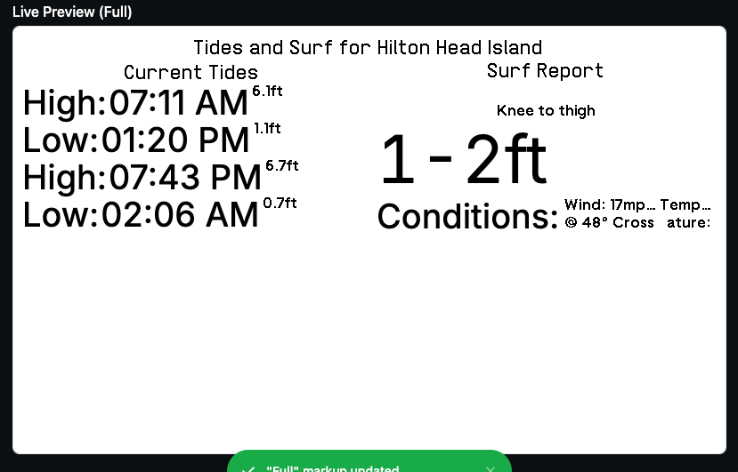

# TRMNL Surf Display App

This application organizes data from Surfline using the [pysurfline API](https://giocaizzi.github.io/pysurfline/examples/SurflineAPI.html) to create a display compatible with TRMNL's framework. The app retrieves real-time surf and tide data and displays it according to the TRMNL markup specifications.

## Requirements

- **Spot ID**: To retrieve surf data, you need the unique `spotId` for each Surfline location.

### Finding the Spot ID

To get the `spotId` for a specific surf spot, follow these steps:

1. Navigate to the Surfline page for your desired spot. For example, Anchor Point: https://www.surfline.com/surf-report/anchor-point/5842041f4e65fad6a7708cfd

2. After the page loads, the URL might change, displaying additional parameters (e.g., camera ID or view mode):

https://www.surfline.com/surf-report/anchor-point/5842041f4e65fad6a7708cfd?camId=5fd1e2a2bdd08a3999f23aa4&view=table

3. Locate the unique 24-character alphanumeric code (in this case, `5842041f4e65fad6a7708cfd`), which is the `spotId` for Anchor Point.

### Using the Spot ID

Once you have the `spotId`, you can poll the Surfline API with a request like this:

https://pollingserver.com/api/surf?spotId=5842041f4e65fad6a7708cfd

## Displaying the Data

The app retrieves and organizes data, displaying it using the HTML markup found in `trmnl_markup.html`. This markup is structured to align with the TRMNL design system and provides a clean, accessible format for surf reports.

### Example Markup

Refer to `trmnl_markup.html` for the display structure, which includes:

- **Tides**: Current high and low tides with timestamps and height.
- **Surf Report**: Human-readable wave heights, wind conditions, and temperature.

## Dependencies

- **pysurfline**: For interacting with the Surfline API and retrieving surf data.
  
## Future Development

This app may expand to include additional features, such as automated spot selection or multiple spot comparisons.

## License

This project is licensed under the MIT License.
